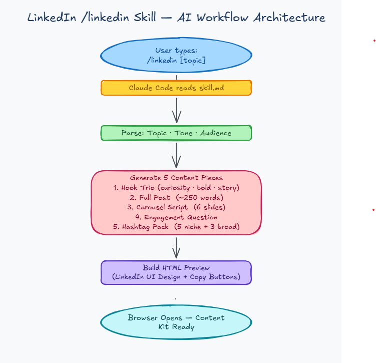
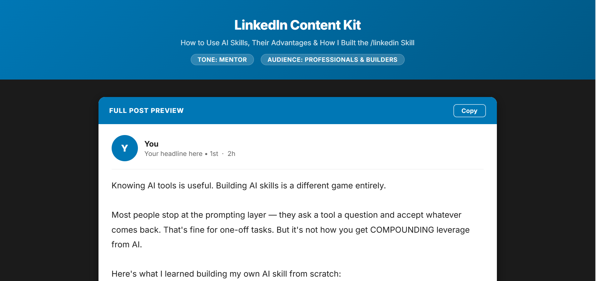

# Skills

[](https://skills.sh/basantpandey/skills/quickui)

A collection of custom Claude Code skills for accelerating development workflows.

## Available Skills

### `/linkedin` — LinkedIn Content Kit

Generate a full LinkedIn content kit from a single topic or story. Produces 5 pieces in one shot and opens a LinkedIn-branded HTML preview with copy buttons.

**Usage:**
```
/linkedin "I just shipped a feature that reduced API latency by 40%"
/linkedin "I got promoted after 3 years of being overlooked" [tone: raw] [audience: mid-career engineers]
```

**Optional tags:**
- `[tone: raw | bold | mentor | story]` — writing voice (default: confident practitioner)
- `[audience: x]` — target reader (default: professionals in the field)

**What it generates:**

**1. Hook Trio** — 3 opening lines using different angles: curiosity gap, bold claim, story opener

**2. Full Post** — Complete ~250-word LinkedIn post, plain text formatted (no markdown, no tables — LinkedIn doesn't render them)

**3. Carousel Script** — 6-slide script for a PDF carousel upload, numbered slides with bold title + body text per slide

**4. Engagement Question** — One comment-bait question to pin as your first reply and drive engagement

**5. Hashtag Pack** — 5 niche + 3 broad hashtags, labeled by specificity

**Output:**
- Saves to `./linkedin-posts/<timestamp>/post.html`
- Opens a LinkedIn-styled browser preview with one-click Copy buttons per section

**How it works:**



**Preview:**



---

### `/quickui` — Quick UI Design Variations

Generate 3 distinct HTML/CSS UI design variations from a plain English description. Useful for rapid POC design exploration without any setup.

**Usage:**
```
/quickui "a login page for a fintech app"
/quickui "sales dashboard with charts and a data table"
/quickui "e-commerce product listing page"
```

**What it generates:**

| Variation | Typography | Style |
|---|---|---|
| Clean & Minimal | Inter | White background, indigo accent, generous whitespace |
| Bold & Vibrant | Poppins | Gradient header, orange/pink palette, energetic layout |
| Dark & Sophisticated | Sora | Dark background, violet glow accent, glassmorphism cards |

Each design varies across: Typography · Color & Theme · Motion · Spatial Composition · Backgrounds & Visual Details.

**Output:**
- Saves 3 HTML files + a gallery to `./ui-designs/<timestamp>/`
- Opens a gallery page in your browser with inline iframe previews
- Click any design to open it fullscreen


---

### `/us-tax-wizard` — US Tax Filing Wizard

An interactive HTML wizard for W-2 employees filing a US federal tax return (IRS Form 1040). Asks 3 quick questions in chat, then generates a personalized step-by-step checklist with progress tracking and IRS.gov links.

**Usage:**
```
/us-tax-wizard
```

Claude will ask:
1. Your filing status (Single, MFJ, MFS, Head of Household)
2. Whether you have dependents
3. Whether you have a mortgage or student loans

**What it generates:**

A self-contained HTML wizard with 5 sections:

**1. Documents to Gather** — Personalized checklist: W-2, SSNs, Form 1098 (mortgage), Form 1098-E (student loans), dependent info, and more

**2. Choose Your Filing Method** — Comparison of IRS Free File, Free File Fillable Forms, commercial software, and tax professionals with links

**3. Key Decisions** — Standard vs. itemized deduction (shows your exact standard deduction amount), deadline status, and personalized credits (Child Tax Credit, EITC, Saver's Credit)

**4. Step-by-Step Filing Walkthrough** — Numbered actions from opening your filing software to submitting and saving your confirmation

**5. After You File** — Refund tracking, record retention, state filing reminder, withholding adjustment, and IRS Identity Protection PIN

**Features:**
- Dynamic tax year detection based on today's date
- Dual progress tracking: horizontal step navigation bar + live percentage fill bar
- Inline IRS.gov links throughout + consolidated resources panel
- All checkboxes persist checked state; completed sections marked with ✓
- Modern fintech design: green accents, card layout, Inter font

**Output:**
- Saves to `./us-tax-wizard/<timestamp>/wizard.html`
- Opens personalized wizard in browser — check off items as you complete them

---

## Installation

### Using `npx skills` (recommended)

Install any skill from this repo with a single command:

```bash
# Install the LinkedIn content kit skill
npx skills add https://github.com/basantpandey/skills --skill linkedin

# Install the QuickUI design variations skill
npx skills add https://github.com/basantpandey/skills --skill quickui

# Install the US Tax Wizard skill
npx skills add https://github.com/basantpandey/skills --skill us-tax-wizard
```

This installs the skill into your Claude Code skills directory automatically.

### Manual installation

Create a junction/symlink from your Claude skills directory to the skill folder:

**Windows:**
```powershell
# LinkedIn skill
cmd /c mklink /J "$env:USERPROFILE\.claude\skills\linkedin" "C:\path\to\skills\linkedin"

# QuickUI skill
cmd /c mklink /J "$env:USERPROFILE\.claude\skills\quickui" "C:\path\to\skills\quickui"

# US Tax Wizard skill
cmd /c mklink /J "$env:USERPROFILE\.claude\skills\us-tax-wizard" "C:\path\to\skills\us-tax-wizard"
```

**macOS / Linux:**
```bash
# LinkedIn skill
ln -s /path/to/skills/linkedin ~/.claude/skills/linkedin

# QuickUI skill
ln -s /path/to/skills/quickui ~/.claude/skills/quickui

# US Tax Wizard skill
ln -s /path/to/skills/us-tax-wizard ~/.claude/skills/us-tax-wizard
```
